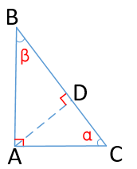
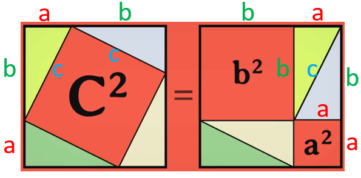

勾股定理  

证明方法一：  
          使用相似三角形  
          来源：[【TED-Ed】勾股定理的N种证法](https://www.bilibili.com/video/av17519252)  
  
这里有三个△：△ABC、△ABD、△ADC  
它们的各自的三个内角分别为：  
```
△ABC：∠A = 90°、∠B = β、∠C = α  
△ABD：∠D = 90°、∠B = β、∠DAB = α  
△ADC：∠D = 90°、∠CAD = β、∠C = α  
=> 它们互为相似三角形：△ABC ∽ △ABD ∽ △ADC  
=> △ABC ∽ △ABD、对于∠B的两边：AB / BC = BD / AB  
=> AB² = BD * BC  --  ①  
=> △ABC ∽ △ADC、对于∠C的两边：AC / BC = DC / AC  
=> AC² = DC * BC  --  ②  
=> ①式和②式相加得：AB² + AC² = BD * BC + DC * BC  
                            = BC * (BD + DC)  
                            = BC²  
=> AB² + AC² = BC²  
```
  
证明方法二：  
          四个三角形构造  
          来源：[【TED-Ed】勾股定理的N种证法](https://www.bilibili.com/video/av17519252)  
使用四个一模一样的直角三角形，构造如下的两个图形即可：  
  
图中、三角形的边长为：a,b,c  
左右两个正方形的边长都是(a+b)、这使得它们的面积相等  
左边正方形的面积 S1 = 4\*S△ + c²  
右边正方形的面积 S2 = 4\*S△ + b² + a²  
=> S1 = S2  
=> a² + b² = c²  

</a>  
