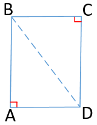
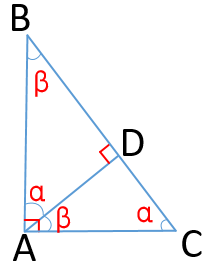
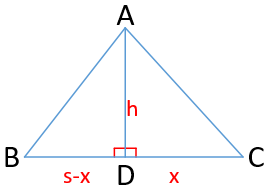

三角形的面积 S = ½sh(h为高、s为底边边长)  

证明：  
已知长方形ABCD、它的面积S = AB * BC  
  
连接BD、得到两个直角三角形：△ABD、△BCD  
由于AB = CD 且 BC = AD 且 BD是共同的边  
所以△ABD ≌ △BCD、它们的面积相等  
=> S△ABD = S△BCD = ½(AB * BC)  
=> 直角三角形的面积等于两个直角边乘积的一半  

但是直角三角形的底和高还有一种情况：  
底边为BC、高为AD  
  
```
△ABC：∠A = 90°、∠B = β、∠C = α  
△ABD：∠D = 90°、∠B = β、∠DAB = α  
△ADC：∠D = 90°、∠CAD = β、∠C = α  
  
=> 它们互为相似三角形：△ABC ∽ △ABD ∽ △DAC  
  
=> △ABC ∽ △DAC、∠B = ∠DAC、它们各自的两边：  
=> AB / BC = AD / AC  
=> AB * AC = AD * BC  
=> ½(AB * AC) = ½(AD * BC)  
=> S△ABC = ½(AD * BC)  

=> △ABC ∽ △ABD、∠C = ∠DAB、它们各自的两边：  
=> AC / BC = AD / AB  --  ⑴  
这也能得到：S△ABC = ½(AD * BC)  
```
所以、直角三角形的面积 S = ½sh(h为高、s为底边边长)  

对于不是直角三角形的其他三角形△ABC：  
  
```
作AD⊥BC、将△ABC分成了两个直角三角形  
假设BC = s、DC = x  
左边：△ADB的面积 S = ½(s-x)h  
右边：△ADC的面积 S = ½xh  
S△ABC = S△ADB + S△ADC  
      = ½(s-x)h + ½xh  
      = ½sh
```
所以、任意三角形的面积 S = ½sh(h为高、s为底边边长)  
