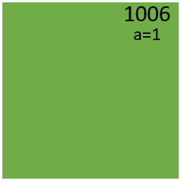
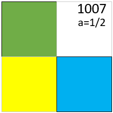
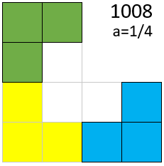
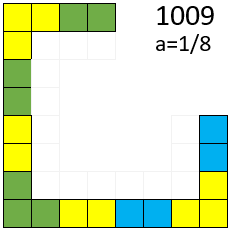
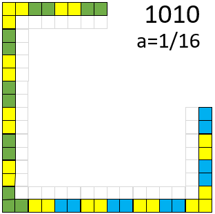

## 切割正方形：  
要求只能切去连续的一整块  
那么、切割n次之后、正方形的面积为多少?  

### 初始条件：  
1. 正方形数量sum = 1
2. 每个正方形的边长为1  
  

### 第1次切割：  
1. 每个正方形被切割成了4个小正方形
2. 每个正方形被舍弃了1个小正方形(舍弃了右上角的小正方形)  
  
结果：
3. 正方形数量sum = 3  
4. 每个小正方形的边长为1/2

### 第2次切割：  
1. 每个正方形被切割成了4个小正方形
2. 每个正方形被舍弃了1个小正方形  
  
结果：  
1. 正方形数量sum = 9  
2. 每个小正方形的边长为1/4

### 第3次切割：  
1. 每个正方形被切割成了4个小正方形
2. 3个角落的正方形、每个都被舍弃了1个小正方形
3. 其他正方形、每个都被舍弃了2个小正方形  
  
结果：  
4. 正方形数量sum = 21
5. 每个小正方形的边长为1/8  

我们定义：
1. 三个角落的正方形为角正方形、记为：C
2. 其他正方形为边正方形、记为：E

### 第4次切割：  
1. 每个正方形被切割成了4个小正方形
2. 3个角正方形、每个都被舍弃了1个小正方形
3. 每个边正方形都被舍弃了2个小正方形  
  
结果：  
4. 正方形数量sum = 45
5. 每个小正方形的边长为1/16

归纳：  
我们可以得到一个表格：  

n    |   a   | C  | E  | sum | S 
---- | ----- | -- | -- | --- | --
0    | 1/2^0 | 1  | 0  | 1   | 1/(2^0)
1    | 1/2^1 | 3  | 0  | 3   | 3/(2^2)
2    | 1/2^2 | 3  | 6  | 9   | 9/(2^4)
3    | 1/2^3 | 3  | 18 | 21  | 21/(2^6)
4    | 1/2^4 | 3  | 42 | 45  | 45/(2^8)

### 结论：  
切割后、小正方形数量为：  
  
切割后的图形面积为：  
  
其中n为切割次数  

文本格式为：  
sum.n = 3C.(n-1) + 2E.(n-1)  
S = sum.n/(2^(n+2))  

由于角正方形永远只有3个、因为只有3个角  
所以：  
  
其中n为切割次数、且n>1  

文本格式为：  
sum.n = 9 + 2E.(n-1)  

### 证明：
00000  
