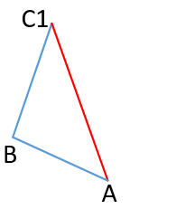
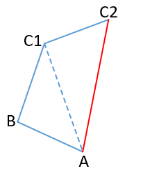
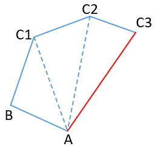
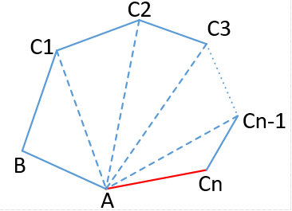

## 问题：  
一个凸边形有n+2条边、它的内角和一定为n\*180°、n是自然数  

### 分析：  

n = 1：  
  
图形 = 1个三角形  
内角和 s = 1\*180°  

n = 2：  
  
增加了一个顶点、相当于增加了一个三角形  
图形 = 2个三角形  
所以、四边形的内角和 s = 2\*180°  

n = 3：  
  
增加了一个顶点、相当于增加了一个三角形  
图形 = 3个三角形  
所以、五边形的内角和 s = 3\*180°  

总结：  
1. n边形有n条边
2. 每增加了一个顶点、相当于增加了一个三角形

### 猜想：  
n = n：  
  
增加了一个顶点、相当于增加了一个三角形  
图形 = n个三角形  
所以、n边形的内角和 s = n\*180°  

### 证明：  